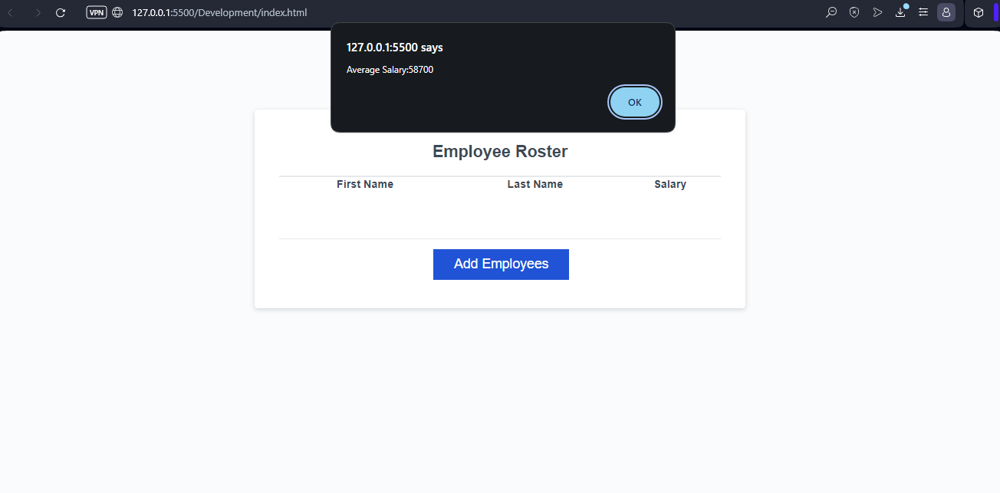
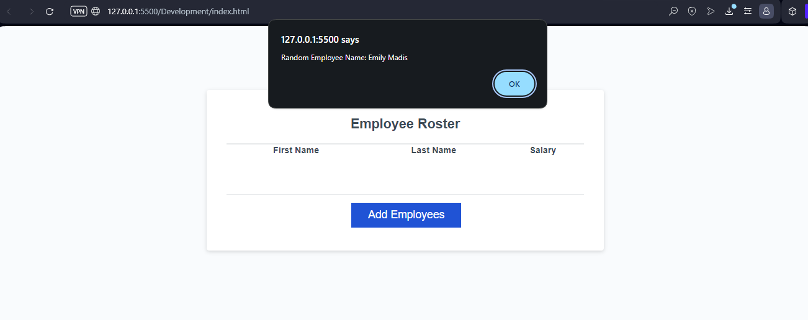
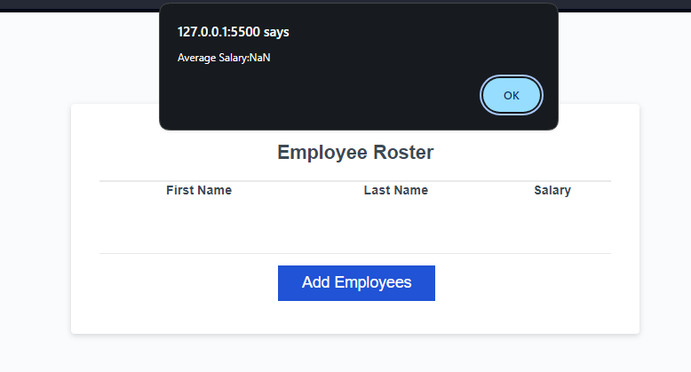
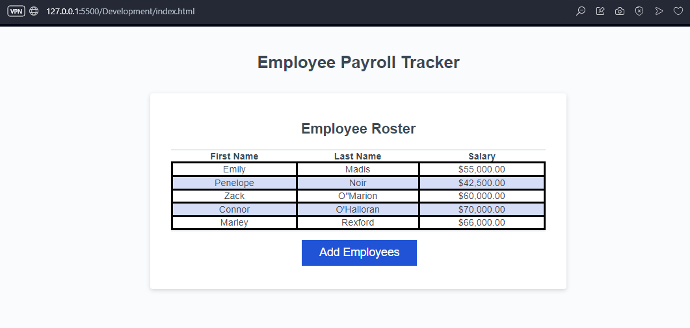
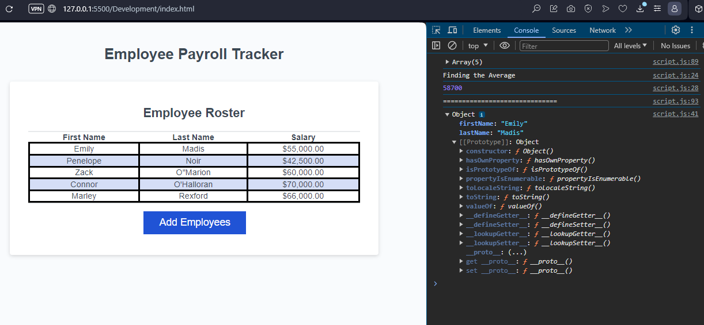

# PayTrackerChallenge3
## Description of Pay Tracker
The following program is a HTML/CSS/JS based payroll tracker.

The basic for the assignment is a create an inital webpage to collect user input First name, Last name, followed by Salary.

At least two complete names are required to make full use of the average salary aspect. Upon finishing the desired amount of employee names and salary, an output of the average salary will be given. then proceeding to the next page where the full list of employees First names, Last names, and Salary will be shown on a chart. displayed in order A to Z using the Last name.

## Installation Guide
The program does not require any installation, the Pay Tracker is operable directly via the browser link.

## How to Use
1 - press the Add Employees button.
2 - enter the First Name of the employee on the prompted space. Press OK.
3 - enter the Last Name of the employee on the prompted space. Press OK.
4 - enter the Salary of the employee on the prompted space, Note that ($) (,) and (.) are already built into the code. If the salary is $50,000.00 only enter 50000. including them will result in a null error. Picture example below
5 - When you are finished confirm that you no longer want to add more employees.
6 - You will then be given the Average Salary of the Employees, A Random Employee name, and then a full graph of all of the names and salarys enter.

## Photos of the program
Average Salary results

Random Name results

The following appears if you have incorrectly entered the employee information.

End page of listed Employees and Salaries

Console log information of the program

## Links to use Pay Tracker
Repo Link
https://github.com/ConnorLuks/PayTrackerChallenge3

GitPages Link
https://connorluks.github.io/PayTrackerChallenge3/

### Credits
Connor O'Halloran